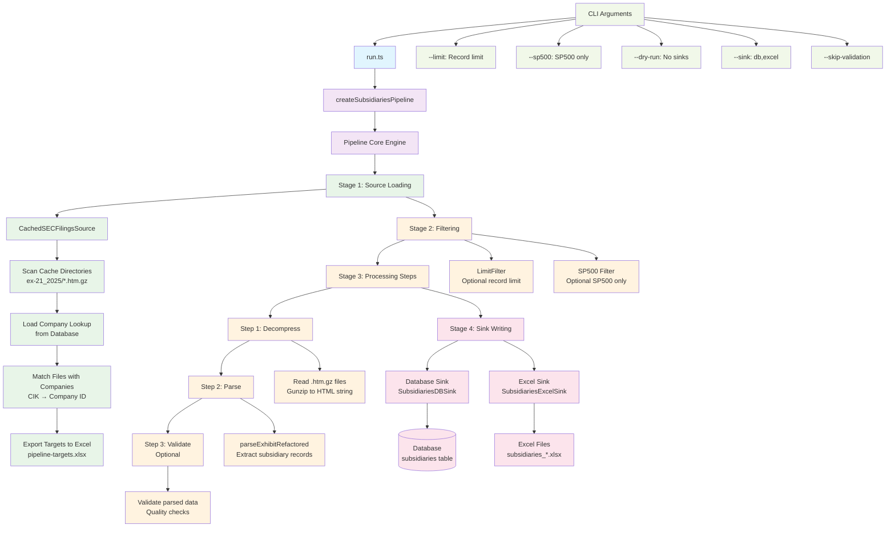

# Financial Graph Backend Architecture

## Pipeline Architecture Overview

The financial graph backend uses a modular pipeline architecture for processing SEC subsidiary data. The pipeline follows a clear flow from data source through processing steps to output sinks.



## Detailed Component Breakdown

### 1. Entry Point (`run.ts`)
- **Purpose**: CLI interface for running the subsidiaries pipeline
- **Features**: 
  - Argument parsing (`--limit`, `--sp500`, `--dry-run`, `--sink`, `--skip-validation`)
  - Pipeline configuration and execution
  - Result reporting with detailed breakdowns

### 2. Pipeline Factory (`index.ts`)
- **Purpose**: Creates and configures the subsidiaries extraction pipeline
- **Configuration**: Year, filters, steps, concurrency, sinks, output directory
- **Flow**: Source → Filter → Steps → Sinks

### 3. Core Pipeline Engine (`Pipeline.ts`)
- **Purpose**: Executes the data processing pipeline with error handling
- **Stages**:
  1. **Source Loading**: Load data from source
  2. **Filtering**: Apply filters to reduce dataset
  3. **Step Processing**: Transform data through processing steps
  4. **Sink Writing**: Output results to configured sinks
- **Features**:
  - Concurrent processing (configurable concurrency)
  - Error handling (fatal vs recoverable errors)
  - Progress tracking and timing
  - Dry-run mode

### 4. Data Source (`CachedSECFilingsSource`)
- **Purpose**: Loads SEC filing data from local cache
- **Process**:
  1. Load company lookup from database (with optional SP500 filter)
  2. Scan cache directories for `.htm.gz` files
  3. Parse filenames to extract CIK and accession numbers
  4. Match files with companies using CIK lookup
  5. Export targets to Excel for tracking
- **Output**: Array of `SECFilingTarget` objects

### 5. Processing Steps

#### Step 1: Decompress (`decompress.ts`)
- **Input**: `SECFilingTarget` (file path)
- **Process**: Read and gunzip `.htm.gz` files to HTML strings
- **Output**: `DecompressedFiling` (with HTML content)

#### Step 2: Parse (`parse.ts`)
- **Input**: `DecompressedFiling` (HTML content)
- **Process**: Use `parseExhibitRefactored` to extract subsidiary records
- **Output**: `ParsedFiling` (with parse results and subsidiary data)
- **Error Handling**: Graceful handling of parser errors

#### Step 3: Validate (`validate.ts`) - Optional
- **Input**: `ParsedFiling`
- **Process**: Quality checks and validation of parsed data
- **Output**: Validated filing data
- **Configurable**: Can be skipped with `--skip-validation`

### 6. Output Sinks

#### Database Sink (`SubsidiariesDBSink`)
- **Purpose**: Write subsidiary records to database
- **Target**: `subsidiaries` table in PostgreSQL
- **Features**: Batch insertion, error handling

#### Excel Sink (`SubsidiariesExcelSink`)
- **Purpose**: Export subsidiary records to Excel files
- **Output**: `subsidiaries_*.xlsx` files
- **Features**: Formatted spreadsheets with metadata

## Data Flow Types

```typescript
// Source Output
interface SECFilingTarget {
  accessionNumber: string;
  cik: string;
  companyId: string;
  companyName: string;
  exhibitType: string;
  cachePath: string;
  url: string;
}

// After Decompression
interface DecompressedFiling extends SECFilingTarget {
  html: string;
}

// After Parsing
interface ParsedFiling extends DecompressedFiling {
  parseResult: ParseResult;
  success: boolean;
}
```

## Configuration Options

### CLI Arguments
- `--limit=N`: Process only N records
- `--sp500`: Process only SP500 companies
- `--dry-run`: Skip sink writing (testing mode)
- `--sink=db,excel`: Specify output sinks
- `--skip-validation`: Skip validation step

### Environment Variables
- `SEC_YEARS`: Year for SEC data processing
- Database connection settings

## Error Handling Strategy

### Error Types
1. **Fatal Errors**: Stop pipeline execution
   - Source loading failures
   - Filter application failures

2. **Recoverable Errors**: Continue with other items
   - Individual step processing failures
   - Sink writing failures

### Error Reporting
- Detailed error logging with stage and item identification
- Error summary in pipeline results
- Graceful degradation for partial failures

## Performance Features

### Concurrency
- Configurable concurrent processing (default: 10)
- Batch processing for optimal throughput
- Progress tracking with percentage completion

### Caching
- Local file cache for SEC filings (`.htm.gz` format)
- Company lookup caching from database
- Efficient file scanning and matching

### Monitoring
- Detailed timing for each stage
- Progress logging every 100 items
- Memory-efficient streaming processing

## Output Artifacts

### Database Records
- Subsidiary records in PostgreSQL
- Company relationships and hierarchies
- Metadata and parsing status

### Excel Reports
- `pipeline-targets.xlsx`: Processing targets
- `subsidiaries_*.xlsx`: Extracted subsidiary data
- Formatted with headers and metadata

### Log Files
- Structured logging with Winston
- Stage-specific timing information
- Error details and recovery actions

This architecture provides a robust, scalable, and maintainable system for processing large volumes of SEC subsidiary data with comprehensive error handling and monitoring capabilities.