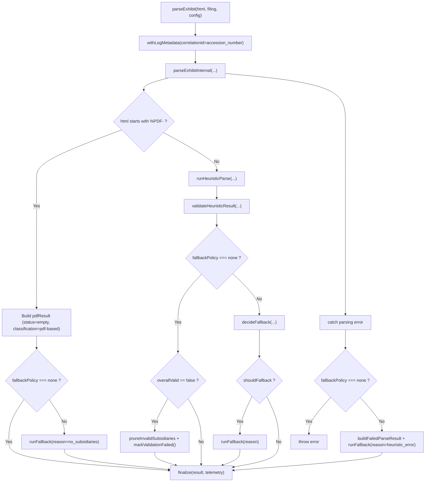

# Subsidiary Parser Architecture (`parseExhibit` entry point)

This document describes the runtime architecture for `src/parser/subsidiary/index.ts`, starting from `parseExhibit`.

It complements:
- `src/parser/subsidiary/shape/ARCHITECTURE.md` (table/shape detection internals)
- `src/parser/subsidiary/data/ARCHITECTURE.md` (data extraction pipeline internals)
- `src/parser/subsidiary/data/COLUMNS.md` (column parsing rules)

## Scope

`index.ts` is the orchestration layer. It does not own low-level table heuristics or row parsing details. It coordinates:

1. Input routing (HTML vs PDF payload)
2. Heuristic parsing
3. Validation gate
4. LLM fallback
5. Final post-processing + telemetry

## Entry Flow

## Phase Responsibilities

### 1) `runHeuristicParse`

1. Load HTML with Cheerio.
2. Call `detectDocumentStructure($, config)`.
3. If structure is `text-based`, `no-table`, or `has-table-no-data`, return non-table result (`empty` status).
4. Else call `extractSubsidiaryRecords(...)` and return `success` if rows were extracted, otherwise `empty`.

### 2) `validateHeuristicResult`

Runs only when heuristic status is `success` and there are extracted subsidiaries.

Rules in this gate:
- Uses `validateSubsidiaries(..., { requireJurisdiction: true })`.
- Captures metrics (`total`, `valid`, `overallValid`, coverage if expected row count exists).
- `overallValid` comes from validator policy (currently valid when at least 90% of rows pass).
- If fallback policy is `none` and `overallValid` is false, the parser prunes invalid rows, keeps valid subsidiaries, and returns `failed`.

### 3) `decideFallback`

Fallback is requested when:

1. `status === "failed"` -> `parsing_failed`
2. `status === "empty"` or no subsidiaries -> `no_subsidiaries`
3. Validation exists and `overallValid === false` -> `validation_failed`

Otherwise heuristic result is accepted.

### 4) `runFallback`

Delegates to `llmFallbackParse(...)` in `src/validation/llm-fallback`.

This stage chooses provider internally based on structure and provider policy, then returns a full `ParseResult`.

For `validation_failed`, the parser passes a pruned heuristic base result (valid rows only) into fallback.

### 5) `finalize`

Always executed before returning:

1. `ensureParentInfo(...)`
2. Attach final telemetry

## Output Contract

`parseExhibit` always returns a `ParseResult` with:

- `subsidiaries`
- `status`
- `classification`
- `llmApplied` / `llmModified`
- Telemetry (`timings`, validation summary, fallback metadata when used)

On hard failures:
- If fallback policy is `none`, parser errors are thrown.
- Otherwise, parser attempts fallback and returns failed/empty/success based on fallback outcome.

## Why `index.ts` and `shape/*` are separate

- `index.ts` answers: "Which path should run and what result should we return?"
- `shape/*` answers: "What is the table/document structure?"
- `data/*` answers: "How do we turn rows/cells into `SubsidiaryRecord`s?"

Keeping these concerns separate makes fallback policy and validation behavior easier to reason about without touching low-level table heuristics.
