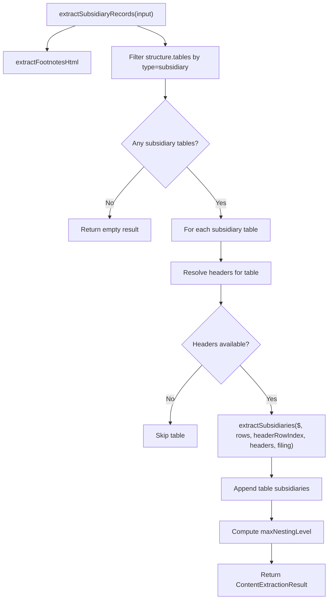

# Subsidiary Data Extraction Architecture

This document explains `src/parser/subsidiary/data` and how rows become `SubsidiaryRecord[]`.

Related docs:
- `src/parser/subsidiary/ARCHITECTURE.md` for top-level `parseExhibit` orchestration
- `src/parser/subsidiary/shape/ARCHITECTURE.md` for table/shape detection
- `src/parser/subsidiary/data/COLUMNS.md` for detailed `parseColumns(...)` rules

## Scope

The `data` layer starts after table shape detection is done. It is responsible for:

1. Selecting subsidiary tables from detected structure.
2. Extracting row-level fields (name, jurisdiction, ownership, footnotes).
3. Building normalized subsidiary records with filing-company parent linkage.
4. Returning normalized `SubsidiaryRecord[]`.

## Runtime Flow

## Main Components

1. `content-extraction.ts`
- Module entry point: `extractSubsidiaryRecords(...)`.
- Coordinates per-table extraction and merges results.
- Handles `footnotesHtml` extraction via `extractFootnotesHtml(...)`.
- Resolves continuation-table headers (cached headers) vs regular headers.

2. `extraction.ts`
- Row iteration and record assembly in `extractSubsidiaries(...)`.
- Determines column indices from headers.
- Calls `parseColumns(...)` per row.
- Applies row filtering (`isHeaderRow`, minimum name sanity).
- Uses flat parent mapping (all subsidiaries map to the filing company parent).
- Generates deterministic subsidiary IDs and final `SubsidiaryRecord` objects.

3. `columns.ts`
- Row-level field parsing and shifted-column recovery.
- Handles row offset (Roman numeral / spacer first cell), jurisdiction fallback scans, and multi-year ownership selection.
- This is the main quality layer for name/jurisdiction/ownership alignment.
- See `src/parser/subsidiary/data/COLUMNS.md` for detailed logic.

4. `cells.ts`
- Primitive parsers for single cells:
  - `parseNameCell(...)`
  - `parseOwnershipCell(...)`
  - `parseJurisdictionCell(...)`

5. `errors.ts`
- Domain-specific extraction errors (for example missing required columns).

## Row-Level Lifecycle (`extractSubsidiaries`)

For each row after header:

1. Remove layout-only cells (`filterContentCells`).
2. Parse normalized fields (`parseColumns`).
3. Skip note header rows and leaked header/subheader rows.
4. Apply footnote-driven jurisdiction inference when available.
5. Set flat parent fields (`parentId` / `parentName`) from filing company.
6. Validate minimum record shape and emit `SubsidiaryRecord`.

## Design Notes

1. Separation of concerns
- `content-extraction.ts` is orchestration.
- `extraction.ts` is row-to-record control flow.
- `columns.ts` is field alignment and shift correction.
- `cells.ts` contains low-level parsing utilities.

2. Why `COLUMNS.md` is separate
- `columns.ts` has the densest heuristics and most parsing edge cases.
- Keeping `COLUMNS.md` focused makes debugging wrong-column assignments faster.

3. Failure behavior
- Missing jurisdiction column in headers can raise `MissingColumnError`.
- The parser orchestration layer decides whether to fallback to LLM after this stage.

## Where This Is Used

- Called by `src/parser/subsidiary/index.ts` through `extractSubsidiaryRecords(...)`.
- Output is later validated and may trigger LLM fallback.
