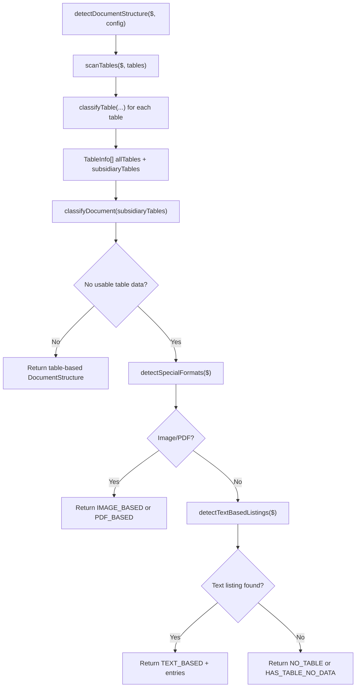
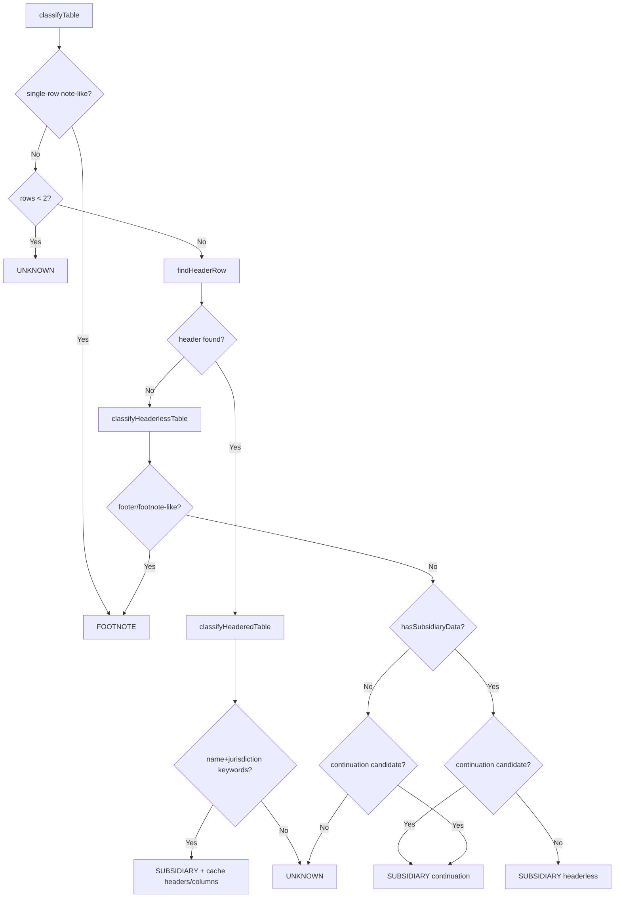

# Subsidiary Shape Detection Architecture

This document explains the architecture in `src/parser/subsidiary/shape`, the main runtime logic, and practical simplification opportunities that keep behavior unchanged.

## Scope

The `shape` layer answers one question:

- What kind of structure does this exhibit have, and which tables likely contain subsidiary data?

It does **not** build `SubsidiaryRecord` rows. That happens in `src/parser/subsidiary/data`.

## Main Components

1. `structure-detection.ts`
- Top-level shape entry point: `detectDocumentStructure($, config)`.
- Orchestrates table scanning/classification.
- Applies fallback structure detection for image/pdf/text-based exhibits.

2. `table-classifier.ts`
- Per-table classification pipeline.
- Produces `TableInfo[]` and document-level table outcome inputs.
- Tracks continuation context across tables (`lastSubsidiaryHeaders`, `lastSubsidiaryColumnCount`).

3. `table-detection.ts`
- Shared heuristics/utilities used by classifier and extraction code.
- Header detection (`findHeaderRow`, `extractHeaders`), data detection (`hasSubsidiaryData`), footer detection, and row/header guards.
- Cell filtering helpers (`filterContentCells`) used outside `shape` too.

4. `special-format-detector.ts`
- Detects non-standard input shape (`PDF_BASED`, `IMAGE_BASED`) from `<embed>/<object>/<iframe>` and large/relevant ``.

## Runtime Flow

## Table Classification Logic (`table-classifier.ts`)

Per table, classification follows this order:

Continuation is determined by previous subsidiary table context and compatible column shape.

## Heuristic Building Blocks (`table-detection.ts`)

1. Lexical signals
- Company/entity suffix signals.
- Jurisdiction keyword signals (from `SUBSIDIARY_KEYWORDS`).
- Ownership percentage pattern signal.

2. Header detection
- `findHeaderRow` searches early rows for strong keyword row, then `<th>`, then inferred header row from label-like row followed by data-like row.
- `extractHeaders` normalizes and returns header text.

3. Headerless-data detection
- `hasSubsidiaryData` scores first rows for company-like and jurisdiction-like patterns.
- Uses coverage thresholds to avoid classifying narrative tables as data.

4. Footer/note rejection
- `isLikelyFooterTable` checks for footnote markers and long narrative-cell density.

5. Layout cell handling
- `filterContentCells` removes empty layout-only cells (often spacer cells in SEC HTML).

6. Row-level header guard (used by extraction)
- `isHeaderRow(name, jurisdiction)` filters rows that still look like headers/subheaders.

## Special Format Detection (`special-format-detector.ts`)

- `PDF_BASED` if an embedded resource points to PDF (`src`, `data`, or `type`).
- `IMAGE_BASED` if an image is substantial in size or has relevant exhibit/subsidiary naming hints.

## What Uses This Layer

1. `src/parser/subsidiary/index.ts`
- Calls `detectDocumentStructure` before data extraction.

2. `src/parser/subsidiary/data/content-extraction.ts`
- Reuses `findHeaderRow` and `extractHeaders` when needed.

3. `src/parser/subsidiary/data/extraction.ts`
- Reuses `filterContentCells` and `isHeaderRow`.

4. `src/validation/subsidiary-validator.ts`
- Reuses `isPossibleHeaderRowText` guard.

## `table-classifier` vs `table-detection`

1. `table-classifier.ts`
- Decides table type and continuation at the table level.
- Owns orchestration and context across multiple tables.

2. `table-detection.ts`
- Provides reusable row/cell/text heuristics.
- Owns primitive detection utilities used by classifier and extraction.

In short:
- `table-classifier` = decision pipeline.
- `table-detection` = heuristic toolkit.

## Simplification Opportunities (No Functional Change)

1. Remove deprecated aliases once callers stop using them
- `looksLikeCompanyName` and `looksLikeJurisdiction` are wrappers around newer names.
- Keep one canonical API: `hasCompanyEntitySuffix`, `containsJurisdictionHeaderKeyword`.

2. Introduce one shared row-signal object
- Today, similar row feature extraction exists in multiple helpers.
- A single `buildRowSignals(...)` would reduce repeated logic and improve readability.

3. Consolidate footnote-like checks in classifier
- `isSingleRowFootnoteTable`, `isFootnoteReferenceTable`, and keyword checks can be composed into one function returning a reason enum.
- Keeps `classifyHeaderlessTable` linear and easier to debug.

4. Mark or move low-use/legacy helpers
- `findAllSubsidiaryTables` is not part of the main scan pipeline.
- Either remove if unused, or move to a legacy/experimental section with clear comments.

5. Reduce `any` usage in shape files
- Add local types for rows/cells where practical.
- This improves maintainability and catches accidental misuse early.

6. Centralize thresholds and constants
- Header scan counts, narrative-length thresholds, and coverage rules are spread across files.
- A single `shape-thresholds.ts` keeps tuning explicit and auditable.

## Suggested Refactor Order

1. Readability-only pass
- Group all exported entry points at bottom (already mostly done).
- Add short comments around decision boundaries.

2. API cleanup pass
- Remove deprecated aliases and update remaining call sites.

3. Signal-model pass
- Add shared row/table signal structs and refactor classifiers to consume them.

4. Type-hardening pass
- Replace high-frequency `any` paths with lightweight local types.

This order minimizes risk and keeps behavior stable while making logic easier to follow.
