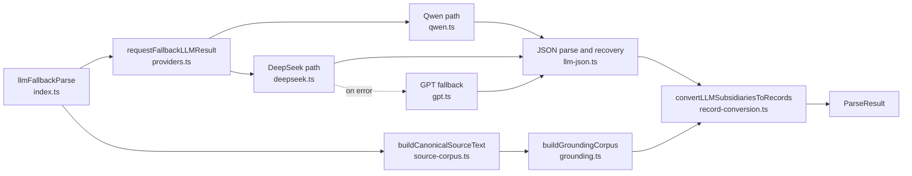
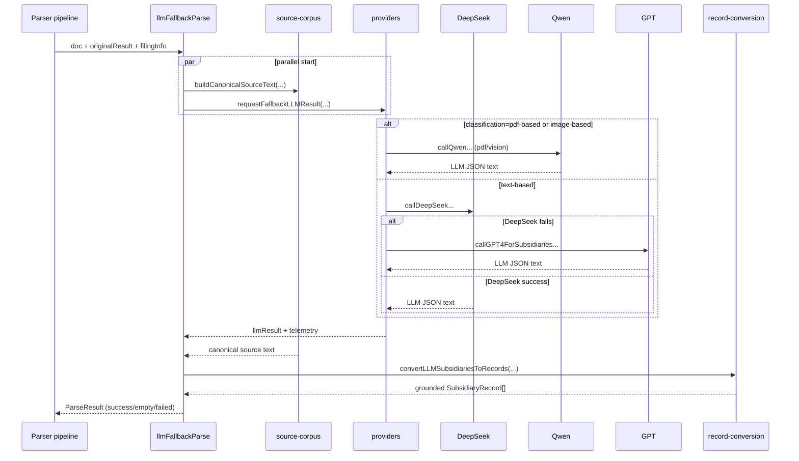

# LLM Fallback Architecture

## Scope

This file is the end-to-end fallback behavior guide (statuses, grounding, conversion, telemetry).

For the current provider internals (router, registry, worker-pool task contract, provider classes), see:
- `src/validation/llm-fallback/ARCHITECTURE_PROVIDER_PIPELINE.md`

## Diagram: Components



## Diagram: Runtime Sequence



## Purpose
`llm-fallback` is the recovery path when rule-based subsidiary parsing is low-confidence or fails validation. It re-parses the filing with LLMs, then applies grounding checks before returning a final `ParseResult`.

## Main Parts

| Part | File | Responsibility |
| --- | --- | --- |
| Orchestrator | `backend/src/validation/llm-fallback/index.ts` | Runs fallback flow, maps statuses (`success`, `empty`, `failed`), builds `llmModifications`, logs telemetry. |
| Provider router | `backend/src/validation/llm-fallback/providers.ts` | Chooses provider by document classification and fallback rules. |
| Canonical source builder | `backend/src/validation/llm-fallback/source-corpus.ts` | Builds canonical plain text used for grounding; optionally writes markdown artifact. |
| Grounding utils | `backend/src/validation/llm-fallback/grounding.ts` | Normalizes text, decodes HTML entities, and checks extracted values against source rows/windows. |
| Record conversion | `backend/src/validation/llm-fallback/record-conversion.ts` | Validates required fields, applies grounding rules, parses ownership, emits `SubsidiaryRecord[]` (flat records). |
| Integrations | `backend/src/integration/{deepseek,qwen,gpt}.ts` | Calls model APIs, retries, maps provider errors, parses JSON output. |
| JSON parser/recovery | `backend/src/integration/llm-json.ts` | Parses strict JSON and recovers partial objects if response is truncated. |
| Raw response debug | `backend/src/integration/llm-debug.ts` | Writes raw LLM response snapshots for parse failures. |

## End-to-End Steps

1. `llmFallbackParse(doc, originalResult, filingInfo)` starts in `index.ts`.
2. Canonical source generation starts immediately (`buildCanonicalSourceText`) and runs in parallel with provider execution.
3. Provider routing (`requestFallbackLLMResult`) uses `classification`:
   - `pdf-based` -> Qwen vision path with PDF input (`requestType=pdf`)
   - `image-based` -> Qwen vision path with SEC image URLs (`requestType=vision`)
   - otherwise -> DeepSeek text path (`requestType=text`)
4. If DeepSeek text fails, router falls back to GPT text model (`provider=gpt`, `fallbackFrom=deepseek`).
5. Provider response is parsed via `parseSubsidiaryJsonResponse`:
   - strict JSON parse first
   - if strict parse fails, best-effort recovery of partial `subsidiaries` objects
6. If model returns no subsidiaries, fallback exits early with `status=empty`.
7. Canonical source is awaited and converted into a grounding corpus.
8. `convertLLMSubsidiariesToRecords` validates and converts each row:
   - `name` is required (blank name rows are dropped)
   - `name` must appear in source line/row windows (otherwise dropped with `name_not_in_corpus`)
   - `jurisdiction` is optional; if present but not found in corpus, it is cleared
   - `ownership_percentage` is optional and parsed when present
   - output is normalized to flat `SubsidiaryRecord` rows
9. If no valid rows survive conversion, fallback returns `status=failed`; otherwise returns `status=success` with converted subsidiaries and diff metadata (`llmModifications`).

## Provider Routing Logic

```text
classification=pdf-based    -> qwen-vl (pdf)
classification=image-based  -> qwen-vl (vision images)
classification=other        -> deepseek (text)
deepseek error              -> gpt (text fallback)
```

## Validation and Grounding Policy

### Hard reject
- Missing `name`
- `name` not found in normalized source rows (`reason=name_not_in_corpus`)

### Soft handling
- Missing `jurisdiction`: allowed
- `jurisdiction` not found in corpus: set to empty

## Artifacts and Observability

- Canonical source markdown dump (enabled by default):
  - `backend/src/output/data/llm_source_markdown/*.md`
- Raw model response snapshots for parse failures:
  - `backend/src/output/data/llm_raw_responses/*.txt`
- Structured telemetry in logs:
  - `provider`, `model`, `requestType`, `fallbackFrom`, `fallbackReasonCode`

## Key Environment Controls

- `DEEPSEEK_MODEL`
- `OPENROUTER_VISION_MODEL`
- `OPENROUTER_TEXT_MODEL`
- `QWEN_SEC_REQUESTS_PER_SECOND`
- `QWEN_MAX_RETRIES`
- `QWEN_RETRY_BASE_DELAY_MS`
- `LLM_FALLBACK_WRITE_SOURCE_MD`
- `LLM_FALLBACK_SOURCE_MAX_CHARS`
- `PDFTOTEXT_TIMEOUT_MS`
- `PDFTOTEXT_MAX_BUFFER_BYTES`
- `LLM_RAW_RESPONSE_LOG_ENABLED`
- `LLM_RAW_RESPONSE_LOG_MAX_CHARS`
