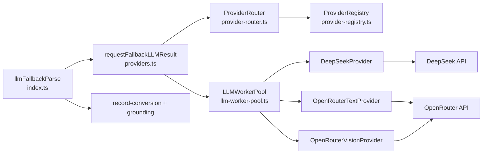
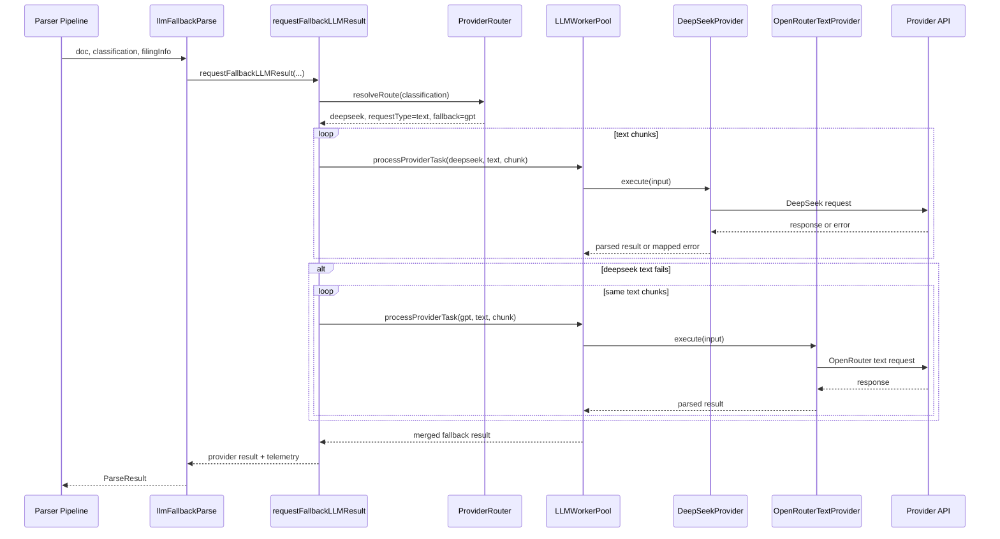

# LLM Fallback Provider Architecture (Updated)

This document explains the new provider-based fallback pipeline implemented from `PRD_PROVIDER_SIMPLIFICATION.md`.

## Scope

This file is the provider-internals guide (router/registry/provider classes/worker-pool task execution).

For the broader fallback lifecycle (grounding, conversion, success/empty/failed behavior), see:
- `src/validation/llm-fallback/ARCHITECTURE.md`

## 1) High-Level Component Diagram

## 2) Request Flow (Text Path)

## 3) Routing Rules

- `pdf-based` -> provider `qwen-vl`, request type `pdf`
- `image-based` -> provider `qwen-vl`, request type `vision`
- all other classifications -> provider `deepseek`, request type `text`, fallback `gpt`

Implementation:
- `src/integration/provider/provider-router.ts`
- `src/validation/llm-fallback/providers.ts`

## 4) Chunking Strategy

- Text chunking: enabled
  - Split by size with overlap, boundary-aware where possible
  - Run each chunk through provider path
  - Merge and dedupe subsidiaries
- Vision chunking: enabled
  - Batch images by chunk size
  - If a batch fails, retry each image in that batch as single-image calls
  - Merge and dedupe subsidiaries
- PDF chunking: not implemented yet
  - Still one PDF payload per request

Implementation:
- `src/validation/llm-fallback/providers.ts`

## 5) Worker Pool Responsibilities

`LLMWorkerPool` now executes provider tasks through provider contracts (not direct concrete integrations):

- Task contract:
  - `requestId`
  - `providerKey` (`deepseek`, `qwen-vl`, `gpt`)
  - `requestType` (`text`, `vision`, `pdf`)
  - `payload`
- Concurrency:
  - global max workers
  - per-provider max workers
- Retry:
  - retry only if `provider.isRetryable(error)` is true
  - retry count from provider config `maxRetries` (default `1`)
  - exponential backoff using provider `retryBaseDelayMs`
- Timeout:
  - hard timeout wrapper around each worker task

Implementation:
- `src/utils/llm-worker-pool.ts`

## 6) Provider Modules and Ownership

- Base contract:
  - `src/integration/provider/base-provider.ts`
  - `src/integration/provider/types.ts`
- Providers:
  - `src/integration/provider/deepseek-provider.ts`
  - `src/integration/provider/openrouter-text-provider.ts`
  - `src/integration/provider/openrouter-vision-provider.ts`
- Registry:
  - `src/integration/provider/provider-registry.ts`

Each provider declares config fields:
- `providerName`
- `modelName`
- `url`
- `timeoutMs`
- `temperature`
- `maxTokens`
- `maxRetries`
- `retryBaseDelayMs`

## 7) What Stayed the Same

- Validation output interface and downstream behavior are unchanged:
  - `src/validation/llm-fallback/index.ts`
  - `src/validation/llm-fallback/record-conversion.ts`
  - `src/validation/llm-fallback/grounding.ts`
- Telemetry fields are still preserved:
  - `provider`
  - `model`
  - `requestType`
  - `fallbackFrom`
  - `fallbackReasonCode`

## 8) Remaining Work

- PDF page-window chunking is still pending.
- Full PRD test plan (unit/integration/regression suites) is still pending.

## Related Docs

- End-to-end fallback behavior: `src/validation/llm-fallback/ARCHITECTURE.md`
- Refactor PRD: `src/validation/llm-fallback/PRD_PROVIDER_SIMPLIFICATION.md`
- Implementation checklist: `src/validation/llm-fallback/PRD_PROVIDER_SIMPLIFICATION_TASKLIST.md`
