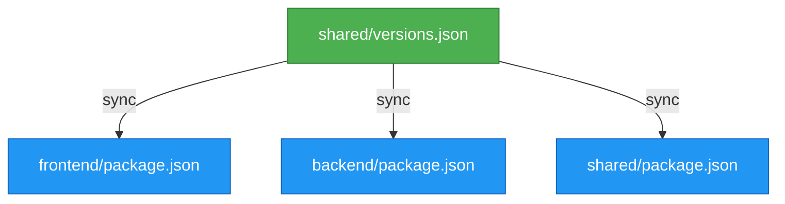
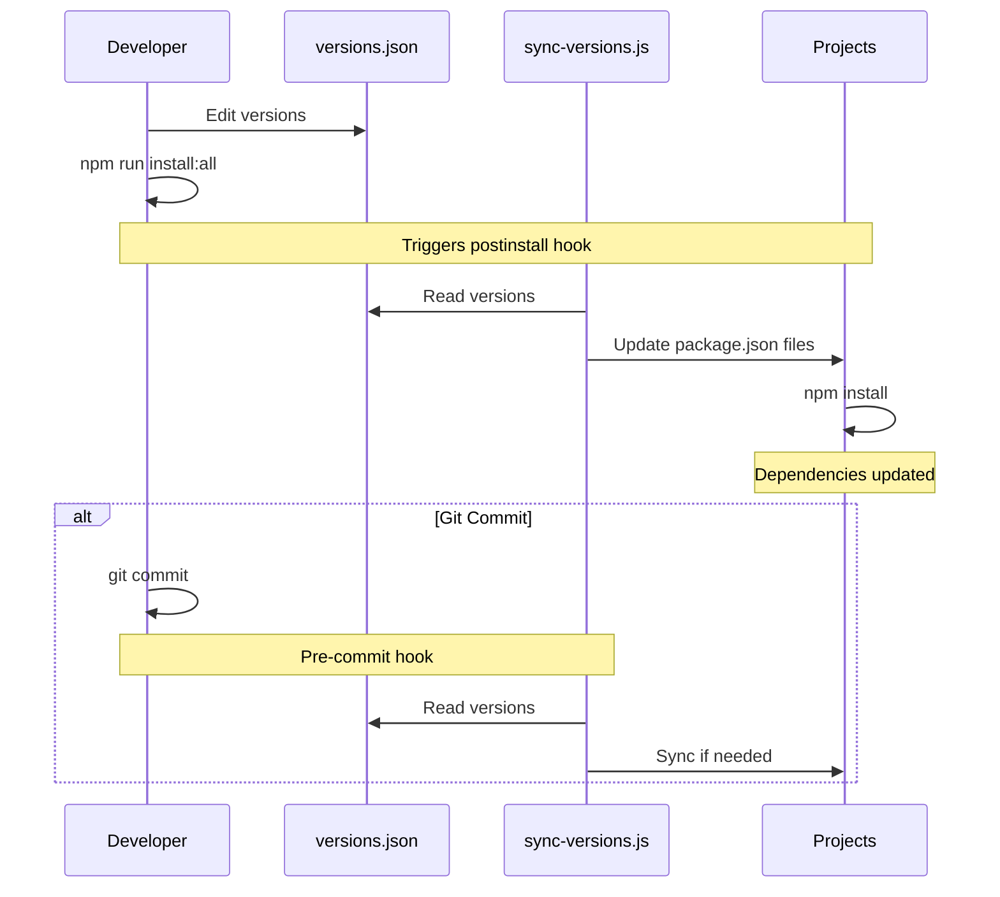

# Financial Graph Shared

Shared types, schema, utilities, and centralized version management for the Financial Graph monorepo.

> **⚠️ Local Workspace Package**: This is referenced by path (`file:../shared`), **not published to npm**.

## What's Included

- **Schema**: InstantDB schema definition
- **Types**: Companies, filings, relationships, enums
- **Utilities**: Type guards, validation, composite keys
- **Version Management**: Centralized `versions.json` for all projects

## Installation

Projects reference this package via local file path:

```json
{
  "dependencies": {
    "financial-graph-shared": "file:../shared"
  }
}
```

From monorepo root:
```bash
npm run install:all
```

## Usage

```typescript
import { Company, CompanyType, isPublicCompany } from "financial-graph-shared";
import schema from "financial-graph-shared/schema";
```

## Version Management

### Architecture



**Single source of truth**: `shared/versions.json` defines all versions, synced automatically to projects.

### Update Workflow



### Quick Start

1. **Edit versions**: Update `shared/versions.json`
2. **Sync & install**: Run `npm run install:all` from root
3. **Auto-sync**: Happens on `npm install` and `git commit`

See `VERSION-MANAGEMENT.md` for details.

## Development

```bash
npm run build        # Compile TypeScript
npm run watch        # Watch mode
npm test             # Run tests
```

## Why Local Path Reference?

✅ Instant changes - no publish cycle  
✅ Always in sync across projects  
✅ Simpler workflow for monorepo  
✅ Bundled directly in production builds
